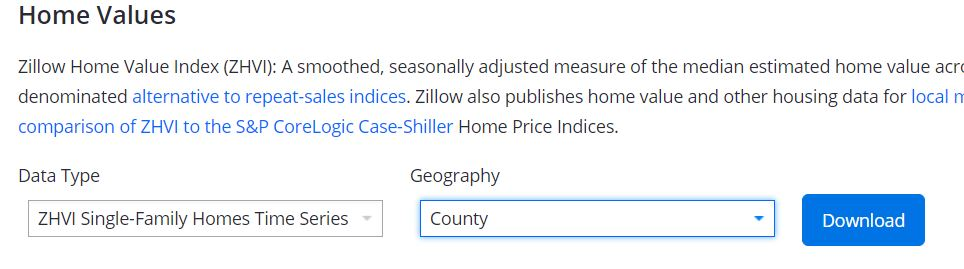
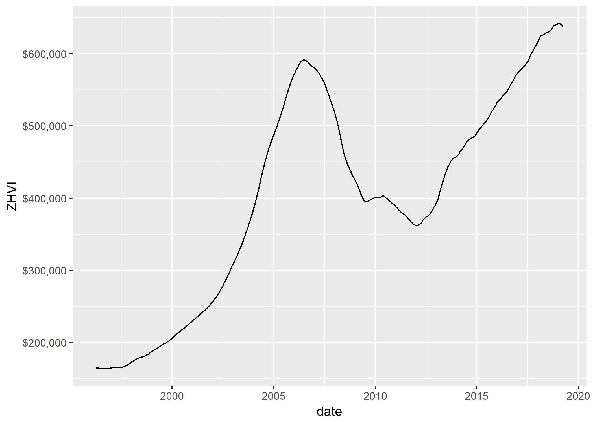

This is going to be a short post. More of a reminder to myself really, on how to reshape zillow data from wide to long. 

#### A short introduction to Zillow data

Zillow hosts an incredible amount of information on their [Zillow Research site](https://www.zillow.com/research/data/)

#### Downloading the Zillow Home Value Index Data

Today I'm going to download the ZHVI for all Single Family Homes (Time Series)  



Once I've got it saved where I want, I can load it into an Rstudio session:  

```{r, warning=FALSE, message=FALSE}
library(readr)
library(dplyr)
zdata <- read_csv("static/data/County_Zhvi_SingleFamilyResidence.csv")

```

Nice. Now taking a look at the data, it doesn't really lend itself to analysis well.  

  

Columns 1 through 7 identify the location, while the remaining columns specify the value (ZHVI) at a certain point in time (April 1996 - Present). In order to get this into a format we can visualize, we can **reshape** this into **long** data. 

To do that we can use the `tidyr` package and the `spread()` function. 

```{r, warning=FALSE, message=FALSE}
library(tidyr)
library(lubridate)
zdata_long <- zdata %>% 
  gather(key = YearMon, value = ZHVI, -c(RegionID:SizeRank)) %>%
  mutate(date = ymd(paste0(YearMon, "-01"))) %>%
  select(-YearMon)
```
What the code above is doing:  
* take the zdata *then*  
* create a new variable called YearMon (from the columns) *and*  
* take the value in those columns and organize them into a variable called ZHVI *while*  
* ignoring the variables from RegionID through SizeRank -- these are the geographic identifiers, so we don't want to turn those into new variables. *then*  
* turn the YearMon variable into a date variable *then*  
* drops the YearMon variable  


#### Now what

Now we have a tidy data frame, where each column is a variable, and each row is an observation. 

Just for fun -- 

```{r, warning=FALSE, message=FALSE}
library(ggplot2)
laplot <- zdata_long %>%
  filter(RegionName == "Los Angeles County") %>%
  ggplot() + geom_line(aes(x = date, y = ZHVI)) +
  scale_y_continuous(label = scales::dollar_format()) 
ggsave("static/img/laplot.png", device = NULL)
```



#### Putting the data into context

So now we have a clean measure of some house prices for all these counties in the US.  

I think maybe if we weight these house prices by their populations, we can get a relatively decent understanding of how house prices are moving across the country. In another post we might do this with data on population. Stay tuned!
