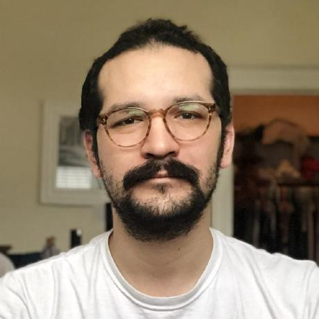

---
---
   
   
  Hello, my name is francisco brady.  
   
  I am currently a Research Analyst at the UChicago Urban Lab's [Poverty Lab](https://urbanlabs.uchicago.edu/labs/poverty)  
  ~~I am currently a research assistant at the federal reserve.~~
  

**None of my opinions represent the views of the federal reserve or any of the reserve banks**  

**None of my spicier takes represent the sum total of the views of the University of Chicago or Urban Labs**

Research Interests:  
- Open source everything  
- Economic research, especially as it pertains to:  
-- inequality  
-- social mobility  
-- urban economics  
-- environmental impacts  
-- other cool things
